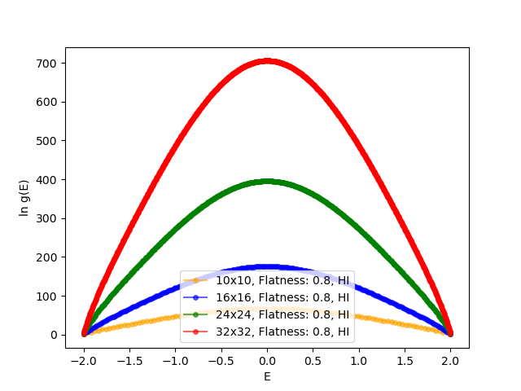
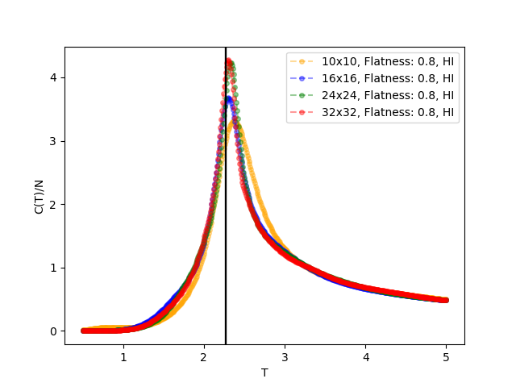
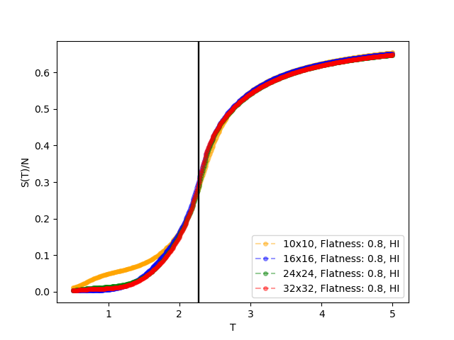
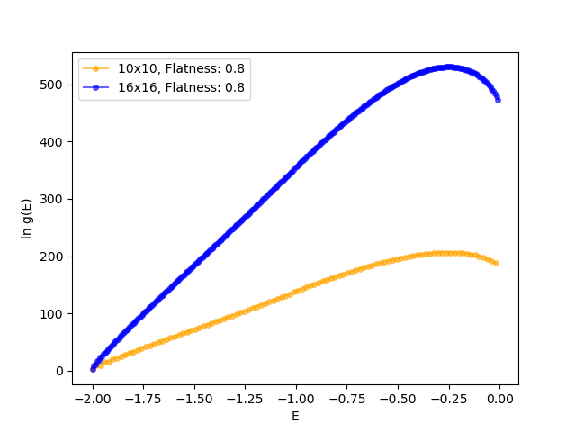
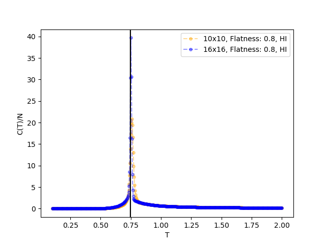
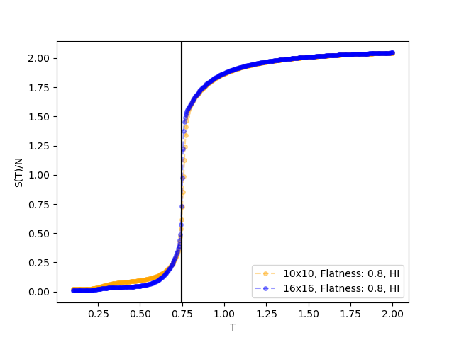

# pottsmodel-python

 [](https://github.com/psf/black)


**Performing the *Wang Landau Algorithm* for the *Q-State Potts 
Model* on a two-dimensional square lattice.**


## Theoretical Background

> [!NOTE]
> The **Wang Landau algorithm** [^1] [^2] estimates the density of states (DOS) by performing random moves, updating probabilities based on energy changes, and iteratively flattening a histogram. It allows uniform energy space sampling, facilitating accurate thermodynamic property calculations over various temperatures, overcoming limitations of traditional *Monte Carlo* methods dependent on specific temperatures. The **Potts model** [^3] is a generalization of the Ising model in statistical mechanics. It describes interacting spins on a lattice, where each spin can be in one of [0,Q) states. The model is used to study phase transitions, critical phenomena, and various problems in condensed matter physics and materials science.

## How to use

```bash
python main.py -g 10 -f example -z 0.8 -m 0.001 -n 100 -q 2
```

| Parameter | Default       |   Description |
| :---      | :---          | :---          |
| -g        | 10      | gridsize                            |
| -f        | WLA-RUN       | directory name               |
| -z        | 0.8          | WLA histogram flatness                                      |
| -m        | 0.000001         | Final ln(f) value |
| -n        | 100          | number of bins  |
| -q        | 2          | number of possible q states |


## Thermodynamic Results

### Ising Model (Q=2)
For the $Q=2$ case a second order phase tranisition can be observed. The vertical line indicates the analytical *Onsager* solution.[^4] The label *HI* indicated that only the energy interval [-2;0] was sampled and then mirrored. The results match thermodynamic calculations reported in the literature.[^2]




### Higher Order (Q=8)
For the $Q=8$ case a first order phase tranisition can be observed. The results match thermodynamic calculations reported in the literature.[^2]




## Known bugs and To-Do's

> [!WARNING]
> - Implement proper energy boundaries (upper and lower energy limits for proper sampling). This currently leads to a small inconsistency at $E=-1.0$ for the $Q=8$ case.
>
>- Parallelization
>- Include calculations for order parameter depending on the temperature


[^1]: [Phys. Rev. Lett. 86, 2050](https://journals.aps.org/prl/abstract/10.1103/PhysRevLett.86.2050)
[^2]: [Am. J. Phys. 72, 1294–1302 (2004)](https://doi.org/10.1119/1.1707017)
[^3]: [Rev. Mod. Phys. 54, 235](https://journals.aps.org/rmp/abstract/10.1103/RevModPhys.54.235)
[^4]: [Phys. Rev. 65, 117](https://journals.aps.org/pr/abstract/10.1103/PhysRev.65.117)
